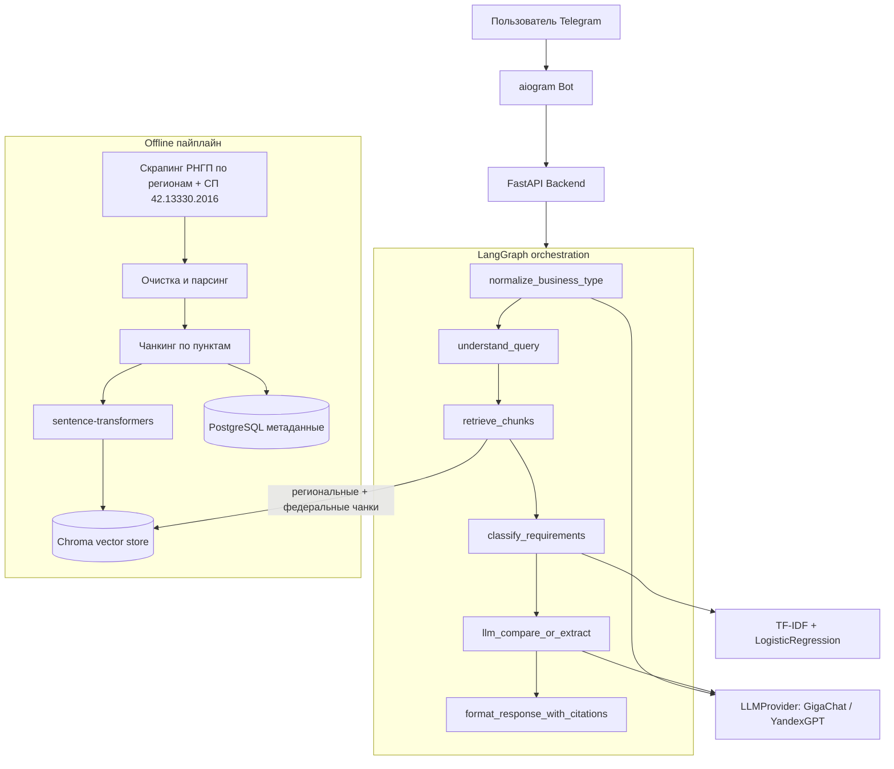

# RegioBuild

Telegram-бот для сравнения региональных строительных нормативов (РНГП) в России.
Бизнесу, который выходит в новый субъект РФ, нужно разбираться в местных
градостроительных требованиях — а удобного инструмента для этого почти нет:
приходится вручную читать постановления и приказы. RegioBuild закрывает
этот разрыв через RAG-пайплайн и LLM с обязательной ссылкой на пункт норматива.

Сама задача не новая. В США давно известна проблема «юридической
фрагментации» между штатами: правила по лицензированию, зонированию и
строительству различаются от юрисдикции к юрисдикции, и на этом рынке
уже появились LegalTech-помощники, которые сравнивают требования между
штатами, а не заставляют юриста и предпринимателя вручную сверять тексты.
В России картина похожая, только вместо штатов — субъекты федерации.
Региональные нормативы градостроительного проектирования (РНГП) устроены
по-разному: где-то нормы детальные и жёсткие, где-то — общие или вовсе
молчат по конкретному типу объекта. Федеральный уровень (СП 42.13330.2016)
задаёт общий каркас, а регионы его уточняют и дополняют — отсюда и смысл
в инструменте сравнения.

Регионы в проекте: Московская область, Краснодарский край, Свердловская
область, Новосибирская область, Республика Татарстан — плюс федеральный
СП 42.13330.2016, который бот подмешивает автоматически, когда
региональный акт по вопросу молчит.

Проект долго собирался локально: пайплайн ingestion, индекс, агент, бот и
прогоны на реальных запросах жили у меня на машине, пока связка не стала
устойчивой. На GitHub выложил уже рабочую версию — репозиторий отражает
результат, а не «первый набросок за выходные».

## Что умеет

1. **Информационный режим** — спросить требования для конкретного типа
   бизнеса в одном регионе (сроки, документы, подключение к сетям, состав
   проекта).
2. **Режим сравнения** — сравнить те же требования между двумя регионами.

Ответ всегда содержит номер пункта норматива, из которого взят факт —
без этого в юридической тематике доверять ответу LLM нельзя. Если по вопросу
у регионального акта и федерального СП 42.13330.2016 разные нормы —
приоритет у регионального; если региональный молчит, бот явно говорит, что
специальных норм нет, и показывает применимую федеральную с отдельной
пометкой источника (а не просит пользователя довериться пустому ответу).

## Архитектура



Почему так, а не проще:

- Retrieval и генерация — разные узлы графа: Recall@k/MRR и качество ответа
  меряются отдельно, проще править по частям.
- `LLMProvider` — общий интерфейс под GigaChat и YandexGPT, чтобы не
  переписывать агента при смене вендора.
- `normalize_business_type` перед retrieval: длинные фразы («хочу открыть
  склад…») плохо матчятся с текстом норматива. Короткие (≤3 слов) не трогаем.
- СП 42.13330.2016 не выбирается в боте как регион — это фон. Приоритет у
  регионального акта; федеральный подмешивается, если регион молчит, с явной
  пометкой источника.

## С чем пришлось разбираться

LegalTech на региональных НПА — это не «подключил LLM к PDF». По ходу
работы всплывал целый пласт инженерных и предметных проблем, из‑за которых
проект растянулся заметно дольше наивной оценки.

**Источники и данные.** У каждого региона свой сайт и свой формат: где‑то
нормальный HTML, где‑то .docx вместо нормального API, где‑то документ
отдаётся кусками при скролле или подменяется HTML‑страницей вместо файла.
Антибот‑защита и нестабильная доступность с разных IP ломали «скачал и
забыл». Часть актов успевала устареть или смениться (как в Свердловской
области), и без ручной проверки актуальности бот легко уезжал в мёртвый
норматив. Объём и плотность текста по регионам тоже разные: один корпус
толстый и подробный, другой — тонкий, и на нём retrieval ведёт себя совсем
иначе.

**Retrieval и юридическая точность.** Один общий запрос по типу бизнеса
забивал top‑k «документами» и оставлял пустыми другие категории. Эмбеддинг
разговорной фразы пользователя плохо совпадал с канцеляритом норматива —
поиск «молчал», хотя текст в индексе был. Модель то и дело подтягивала
похожие, но чужие объекты (рынок вместо торгового центра, вино‑водочный
вместо табачного) или общие нормы без пометки, что это не спецтребование.
Отдельно болела связка региональный акт ↔ федеральный СП: нужно было не
смешивать источники в одной цитате и не выдавать федеральный пункт за
региональный. Цитаты модель иногда оформляла криво («п. пункт …»), JSON
оборачивала в markdown‑ограждения, а в режиме сравнения подставляла
человеческие названия регионов вместо кодов — и ломала рендер.

**Инфраструктура и прод.** Тяжёлая embedding‑модель на дешёвом тарифе
упиралась в RAM и давала 502 на первом запросе. Хостинг без docker‑compose
заставил упаковать api и bot в один образ с переключением роли. Прокси,
порты и холодный старт модели превращали «просто задеплоить» в отдельный
квест. Длинные ответы Telegram обрезал, а пользователи писали что угодно —
от опечаток и капса до откровенного мусора и просьб про секреты, на что
нельзя было бездумно жечь токены LLM.

Всё это пришлось проживать итерациями: локально отлаживать пайплайн,
смотреть живые диалоги, ломать и снова собирать ответ агента, пока поведение
не стало предсказуемым для портфолио и для реальной проверки руками.

## Стек

| Категория      | Технологии                                             |
|----------------|----------------------------------------------------------|
| Язык           | Python 3.11, asyncio, type hints                          |
| ML/NLP         | sentence-transformers, scikit-learn (TF-IDF + LogReg)      |
| Векторная БД   | Chroma                                                     |
| Оркестрация    | LangGraph                                                  |
| LLM            | GigaChat API / YandexGPT API за абстракцией `LLMProvider`  |
| Backend        | FastAPI                                                    |
| БД метаданных  | PostgreSQL + SQLAlchemy + Alembic                          |
| Бот            | aiogram 3.x                                                |
| Инфраструктура | Docker, docker-compose                                     |

## Структура репозитория

```
RegioBuild/
  app/
    core/          # конфигурация, справочник регионов
    ingestion/     # скрапинг, парсинг, чанкинг нормативных документов
    embeddings/     # обёртка над sentence-transformers
    vectorstore/    # клиент Chroma + retrieval
    classifier/     # TF-IDF + LogisticRegression: обучение и инференс
    llm/             # LLMProvider (GigaChat / YandexGPT), промпты, схемы
    agent/           # LangGraph-граф оркестрации
    api/             # FastAPI приложение
    bot/             # aiogram Telegram-бот
    eval/            # Recall@k/MRR и регрессия качества ответов
    db/              # SQLAlchemy модели
  migrations/         # Alembic
  data/
    raw/             # скачанные исходники нормативов (не в git)
    processed/       # чанки после парсинга (не в git)
    chroma/          # векторный индекс (в git — нужен готовый образ для хостинга)
  tests/
  docker-compose.yml           # локальный вариант: sqlite + api + bot (см. ниже)
  docker-compose.postgres.yml  # для локальной обкатки миграций против Postgres
  Dockerfile.api               # для docker-compose
  Dockerfile.bot               # для docker-compose
  Dockerfile                   # для Bothost (SERVICE_ROLE переключает api/bot, см. ниже)
  entrypoint.sh                 # точка входа для Dockerfile выше
  requirements.txt
  alembic.ini
  .env.example
```

## Запуск локально

```bash
python -m venv venv
venv\Scripts\activate       # Linux/Mac: source venv/bin/activate
pip install -r requirements.txt
copy .env.example .env      # Linux/Mac: cp .env.example .env
```

Заполните в `.env` ключи GigaChat/YandexGPT и токен бота, затем:

```bash
alembic upgrade head                  # миграции БД (по умолчанию sqlite)
python -m app.ingestion.pipeline       # скрапинг + парсинг + чанкинг РНГП
python -m app.embeddings.build_index   # эмбеддинги + индекс Chroma
python -m app.classifier.train         # классификатор категорий требований

uvicorn app.api.main:app --reload      # backend
python -m app.bot.main                 # бот, в отдельном терминале
```

## Тесты и метрики качества

```bash
pytest
python -m app.eval.retrieval_eval   # Recall@k, MRR
python -m app.eval.answer_eval      # регрессия качества ответов агента
```

## Через Docker

```bash
python -m app.classifier.train   # если ещё не обучен — нужен для сборки образа
docker compose up --build
```

Два контейнера: `api` (FastAPI, :8000) и `bot` (aiogram polling), общаются по
внутренней сети docker-compose по имени сервиса. Секреты (`TELEGRAM_BOT_TOKEN`,
креды LLM-провайдера) передаются через переменные окружения хоста — см. список
нужных переменных в `docker-compose.yml`.

Если нужен полноценный Postgres (например, чтобы погонять миграции против
настоящей БД, а не SQLite) — `docker compose -f docker-compose.postgres.yml
--env-file .env up --build`.

## Продакшн-деплой (Bothost)

Прод на [Bothost](https://bothost.ru): git-деплой и Docker. Платформа
разворачивает один корневой `Dockerfile` на один контейнер и не умеет
docker-compose — поэтому api и telegram-бот это два бота в панели из одного
образа, роль задаётся через `SERVICE_ROLE`. Локальные `Dockerfile.api` /
`Dockerfile.bot` Bothost не использует.

Шаги:

1. Локально прогнать полный пайплайн (`app.ingestion.pipeline`,
   `app.embeddings.build_index`, `app.classifier.train`) и закоммитить
   получившиеся `data/chroma/` и `app/classifier/artifacts/` — они специально
   выведены из-под общего игнора для регенерируемых данных (см. `.gitignore`).
   Пересобирать индекс на арендованном сервере ненадёжно: неизвестен лимит
   RAM, а сайты с нормативами не всегда одинаково доступны с разных IP.
2. Запушить репозиторий на GitHub.
3. В панели Bothost создать **два** бота из одного репозитория (ветка
   `main`), у обоих включить опцию "использовать собственный Dockerfile":
   - **api** — переменные `SERVICE_ROLE=api`, `DATABASE_URL` (например,
     `sqlite:////app/data/regiobuild.db` — `/app/data` единственная папка,
     которую Bothost не затирает при передеплое), `LLM_PROVIDER` и креды
     провайдера (`GIGACHAT_CREDENTIALS` либо `YANDEX_API_KEY` +
     `YANDEX_FOLDER_ID`). У этого бота нужно включить домен (веб-интерфейс) —
     второй бот будет ходить к нему по HTTPS.
   - **bot** — переменные `SERVICE_ROLE=bot`, `TELEGRAM_BOT_TOKEN`,
     `API_BASE_URL=https://<домен бота api>` (у Bothost боты внутри одного
     аккаунта не видят друг друга по внутренней docker-сети, поэтому ходить
     нужно по публичному домену api-бота, а не по имени сервиса). Домен этому
     боту не нужен — работает long polling, а не webhook.
4. У бота **api** внутренний порт в настройках должен совпадать с тем, что
   реально слушает контейнер (`entrypoint.sh` берёт порт из `PORT`, который
   Bothost сам прокидывает — если панель просит указать порт вручную, ставить
   `8000`). Несовпадение — типичная причина 502 на статической странице.
5. Проверить в панели, что оба бота укладываются в RAM тарифа: сейчас в
   проде стоит `paraphrase-multilingual-MiniLM-L12-v2` (~470 МБ весов) —
   на Basic Bothost она проходит, более тяжёлый mpnet-base на этом тарифе
   уже не влезал.
6. После каждого обновления нормативов — повторить шаг 1 и запушить: оба бота
   передеплоятся по git-пушу автоматически.

## Источники нормативов

Нормативные правовые акты не защищены авторским правом (ст. 1259 ГК РФ),
поэтому парсинг их текста юридически не проблема — вопрос только в том, где
взять сам текст без блокировки антибот-защитой:

- **Московская область** — Постановление Правительства МО от 17.08.2015
  № 713/30. Полный текст стабильно доступен на meganorm.ru.
- **Краснодарский край** — Приказ департамента по архитектуре и
  градостроительству КК от 16.04.2015 № 78. Источник — docs.cntd.ru
  (документ 428544016); альтернативно текст в .docx публикуют
  муниципальные администрации края (например, admnvrsk.ru).
- **Свердловская область** — Приказ Минстроя области от 01.08.2023 № 435-П
  (сменил старое постановление 2010 г., которое утратило силу в 2024-м).
- **Новосибирская область** — Постановление Правительства НСО от 12.08.2015
  № 303-п, текст на novosib-gov.ru.
- **Республика Татарстан** — Постановление КМ РТ от 27.12.2013 № 1071,
  текст на meganorm.ru.
- **Федеральный уровень** — СП 42.13330.2016 "Градостроительство. Планировка
  и застройка городских и сельских поселений" (актуализированная редакция
  СНиП 2.07.01-89*), утв. приказом Минстроя от 30.12.2016 № 1034/пр.
  Текст на meganorm.ru.

Полные ссылки и даты последней ручной проверки актуальности — в
`app/core/regions.py` (поле `last_verified`; федеральный документ — константа
`FEDERAL_DOCUMENT` там же, не в словаре `REGIONS`, чтобы его не предлагали
выбрать как обычный регион для сравнения).

Если скрапинг у вас не проходит (сайт отдаёт капчу/403) — просто сохраните
страницу вручную в браузере и положите в `data/raw/` под именем, указанным
в `app/core/regions.py`. Пайплайн подхватит файл и не полезет за ним в сеть.

## Автор

Никита Мокин — [GitHub](https://github.com/NikitaMok) · [LinkedIn](https://ru.linkedin.com/in/mokinnikita)
