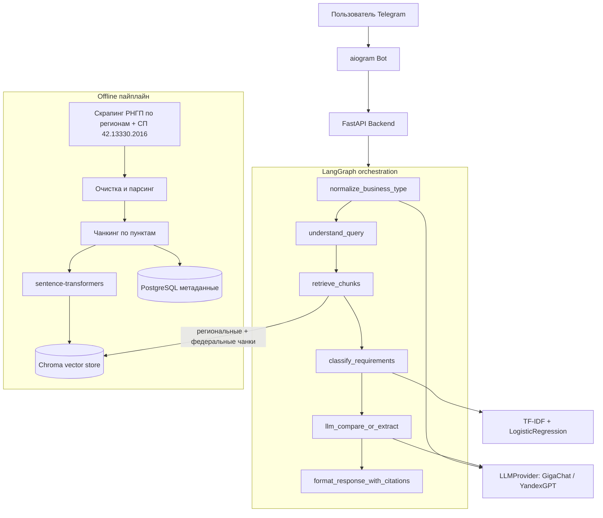

# RegioBuild

Telegram-бot для сравнения региональных строительных нормативов (РНГП) в России.
Идея простая: бизнес, который расширяется в новый регион, должен разбираться
в местных градостроительных требованиях, а единого удобного инструмента для
этого нет — приходится вручную лезть в постановления и приказы. RegioBuild
делает это через RAG-пайплайн + LLM с обязательной ссылкой на пункт норматива.

Регионы: Московская область, Краснодарский край, Свердловская область,
Новосибирская область, Республика Татарстан — плюс федеральный уровень
(СП 42.13330.2016), который бот подмешивает к любому региону автоматически,
когда региональный акт по вопросу молчит.

Сам столкнулся с этой проблемой, когда прикидывал требования под автомойку:
чтобы понять, чем регламент одной области отличается от другой, приходится
вручную открывать оба постановления и построчно их сравнивать — там нет ни
единой структуры изложения, ни поиска по смыслу, только Ctrl+F по тексту
приказа. Отсюда и появилась идея сделать для этого отдельный инструмент.

## Что умеет

1. **Информационный режим** — спросить требования для конкретного типа
   бизнеса в одном регионе (сроки, документы, подключение к сетям, состав
   проекта).
2. **Режим сравнения** — сравнить те же требования между двумя регионами.

Ответ всегда содержит номер пункта норматива, из которого взят факт —
без этого в юридической тематике доверять ответу LLM нельзя. Если по вопросу
у регионального акта и федерального СП 42.13330.2016 разные нормы —
приоритет у регионального; если региональный молчит, бот явно говорит, что
специальных норм нет, и показывает применимую федеральную с отдельной
пометкой источника (а не просит пользователя довериться пустому ответу).

## Архитектура



Почему так, а не проще:

- Retrieval и генерация разделены на отдельные узлы графа (а не один большой
  промпт), потому что так проще отдельно мерить и улучшать каждый этап —
  качество поиска (Recall@k/MRR) и качество финального ответа это разные вещи.
- LLM-провайдер вынесен за интерфейс `LLMProvider`, чтобы не зависеть от
  одного вендора — у GigaChat и YandexGPT разные лимиты, цены и стабильность,
  разумно иметь возможность переключиться без переписывания агента.
- `normalize_business_type` — отдельный узел перед retrieval. Пользователи
  пишут не «автомойка», а целыми предложениями («хочу построить автомойку в
  Краснодаре, у меня уже есть такая...»), и эмбеддинг такой фразы плохо похож
  на текст норматива — retrieval находит пустоту. Короткие фразы (≤3 слов)
  не трогаем, чтобы не тратить лишний вызов LLM на то, что и так похоже на
  тип бизнеса.
- Федеральный уровень (СП 42.13330.2016) — не отдельный "регион" для выбора
  в боте, а фоновый источник, который `retrieve_chunks` подтягивает для
  любого запроса наравне с регионом. Регион в РФ не может дать бизнесу меньше
  прав, чем федеральный документ, но может уточнить/детализировать — поэтому
  в промпте региональному акту явно отдан приоритет, а федеральный подключается
  только там, где региональный молчит (с обязательной пометкой источника,
  чтобы не выглядело так, будто это одна и та же норма).

## Стек

| Категория      | Технологии                                             |
|----------------|----------------------------------------------------------|
| Язык           | Python 3.11, asyncio, type hints                          |
| ML/NLP         | sentence-transformers, scikit-learn (TF-IDF + LogReg)      |
| Векторная БД   | Chroma                                                     |
| Оркестрация    | LangGraph                                                  |
| LLM            | GigaChat API / YandexGPT API за абстракцией `LLMProvider`  |
| Backend        | FastAPI                                                    |
| БД метаданных  | PostgreSQL + SQLAlchemy + Alembic                          |
| Бот            | aiogram 3.x                                                |
| Инфраструктура | Docker, docker-compose                                     |

## Структура репозитория

```
RegioBuild/
  app/
    core/          # конфигурация, справочник регионов
    ingestion/     # скрапинг, парсинг, чанкинг нормативных документов
    embeddings/     # обёртка над sentence-transformers
    vectorstore/    # клиент Chroma + retrieval
    classifier/     # TF-IDF + LogisticRegression: обучение и инференс
    llm/             # LLMProvider (GigaChat / YandexGPT), промпты, схемы
    agent/           # LangGraph-граф оркестрации
    api/             # FastAPI приложение
    bot/             # aiogram Telegram-бот
    eval/            # Recall@k/MRR и регрессия качества ответов
    db/              # SQLAlchemy модели
  migrations/         # Alembic
  data/
    raw/             # скачанные исходники нормативов (не в git)
    processed/       # чанки после парсинга (не в git)
    chroma/          # векторный индекс (в git — нужен готовый образ для хостинга)
  tests/
  docker-compose.yml           # локальный вариант: sqlite + api + bot (см. ниже)
  docker-compose.postgres.yml  # для локальной обкатки миграций против Postgres
  Dockerfile.api               # для docker-compose
  Dockerfile.bot               # для docker-compose
  Dockerfile                   # для Bothost (SERVICE_ROLE переключает api/bot, см. ниже)
  entrypoint.sh                 # точка входа для Dockerfile выше
  requirements.txt
  alembic.ini
  .env.example
```

## Запуск локально

```bash
python -m venv venv
venv\Scripts\activate       # Linux/Mac: source venv/bin/activate
pip install -r requirements.txt
copy .env.example .env      # Linux/Mac: cp .env.example .env
```

Заполните в `.env` ключи GigaChat/YandexGPT и токен бота, затем:

```bash
alembic upgrade head                  # миграции БД (по умолчанию sqlite)
python -m app.ingestion.pipeline       # скрапинг + парсинг + чанкинг РНГП
python -m app.embeddings.build_index   # эмбеддинги + индекс Chroma
python -m app.classifier.train         # классификатор категорий требований

uvicorn app.api.main:app --reload      # backend
python -m app.bot.main                 # бот, в отдельном терминале
```

## Тесты и метрики качества

```bash
pytest
python -m app.eval.retrieval_eval   # Recall@k, MRR
python -m app.eval.answer_eval      # регрессия качества ответов агента
```

## Через Docker

```bash
python -m app.classifier.train   # если ещё не обучен — нужен для сборки образа
docker compose up --build
```

Два контейнера: `api` (FastAPI, :8000) и `bot` (aiogram polling), общаются по
внутренней сети docker-compose по имени сервиса. Секреты (`TELEGRAM_BOT_TOKEN`,
креды LLM-провайдера) передаются через переменные окружения хоста — см. список
нужных переменных в `docker-compose.yml`.

Если нужен полноценный Postgres (например, чтобы погонять миграции против
настоящей БД, а не SQLite) — `docker compose -f docker-compose.postgres.yml
--env-file .env up --build`.

## Продакшн-деплой (Bothost)

Бот и API крутятся постоянно на [Bothost](https://bothost.ru) — git-деплой,
Docker-сборка, платный тариф стоит сравнимо с чашкой кофе в месяц. Важная
особенность платформы: она разворачивает **один** Dockerfile из корня
репозитория на **один** контейнер ("бот" в терминологии панели) и не умеет
docker-compose. Поэтому api и telegram-бот — это два отдельных бота в панели,
собранные из одного и того же `Dockerfile` (не `Dockerfile.api`/
`Dockerfile.bot` — тем, что лежат в репозитории для локального
docker-compose, Bothost не пользуется), а какой процесс внутри запускать,
решает переменная окружения `SERVICE_ROLE`.

Шаги:

1. Локально прогнать полный пайплайн (`app.ingestion.pipeline`,
   `app.embeddings.build_index`, `app.classifier.train`) и закоммитить
   получившиеся `data/chroma/` и `app/classifier/artifacts/` — они специально
   выведены из-под общего игнора для регенерируемых данных (см. `.gitignore`).
   Пересобирать индекс на арендованном сервере ненадёжно: неизвестен лимит
   RAM, а сайты с нормативами не всегда одинаково доступны с разных IP.
2. Запушить репозиторий на GitHub.
3. В панели Bothost создать **два** бота из одного репозитория (ветка
   `main`), у обоих включить опцию "использовать собственный Dockerfile":
   - **api** — переменные `SERVICE_ROLE=api`, `DATABASE_URL` (например,
     `sqlite:////app/data/regiobuild.db` — `/app/data` единственная папка,
     которую Bothost не затирает при передеплое), `LLM_PROVIDER` и креды
     провайдера (`GIGACHAT_CREDENTIALS` либо `YANDEX_API_KEY` +
     `YANDEX_FOLDER_ID`). У этого бота нужно включить домен (веб-интерфейс) —
     второй бот будет ходить к нему по HTTPS.
   - **bot** — переменные `SERVICE_ROLE=bot`, `TELEGRAM_BOT_TOKEN`,
     `API_BASE_URL=https://<домен бота api>` (у Bothost боты внутри одного
     аккаунта не видят друг друга по внутренней docker-сети, поэтому ходить
     нужно по публичному домену api-бота, а не по имени сервиса). Домен этому
     боту не нужен — работает long polling, а не webhook.
4. У бота **api** внутренний порт в настройках должен совпадать с тем, что
   реально слушает контейнер (`entrypoint.sh` берёт порт из `PORT`, который
   Bothost сам прокидывает — если панель просит указать порт вручную, ставить
   `8000`). Несовпадение — типичная причина 502 на статической странице.
5. Проверить в панели, что оба бота реально укладываются в RAM тарифа:
   эмбеддинг-модель (`paraphrase-multilingual-mpnet-base-v2`, ~1.1 ГБ весов)
   грузится в память при каждом старте api-контейнера. Если тариф не
   вытягивает — либо перейти на Pro, либо заменить модель в `config.py` на
   более лёгкую (`paraphrase-multilingual-MiniLM-L12-v2`, ~470 МБ) и
   переиндексировать.
6. После каждого обновления нормативов — повторить шаг 1 и запушить: оба бота
   передеплоятся по git-пушу автоматически.

## Источники нормативов

Нормативные правовые акты не защищены авторским правом (ст. 1259 ГК РФ),
поэтому парсинг их текста юридически не проблема — вопрос только в том, где
взять сам текст без блокировки антибот-защитой:

- **Московская область** — Постановление Правительства МО от 17.08.2015
  № 713/30. Полный текст стабильно доступен на meganorm.ru.
- **Краснодарский край** — Приказ департамента по архитектуре и
  градостроительству КК от 16.04.2015 № 78. Источник — docs.cntd.ru
  (документ 428544016); альтернативно текст в .docx публикуют
  муниципальные администрации края (например, admnvrsk.ru).
- **Свердловская область** — Приказ Минстроя области от 01.08.2023 № 435-П
  (сменил старое постановление 2010 г., которое утратило силу в 2024-м).
- **Новосибирская область** — Постановление Правительства НСО от 12.08.2015
  № 303-п, текст на novosib-gov.ru.
- **Республика Татарстан** — Постановление КМ РТ от 27.12.2013 № 1071,
  текст на meganorm.ru.
- **Федеральный уровень** — СП 42.13330.2016 "Градостроительство. Планировка
  и застройка городских и сельских поселений" (актуализированная редакция
  СНиП 2.07.01-89*), утв. приказом Минстроя от 30.12.2016 № 1034/пр. Текст
  тоже на meganorm.ru — тот же движок сайта, что уже проверен на Московской
  области и Татарстане, никаких новых заморочек с парсингом не потребовалось.

Полные ссылки и даты последней ручной проверки актуальности — в
`app/core/regions.py` (поле `last_verified`; федеральный документ — константа
`FEDERAL_DOCUMENT` там же, не в словаре `REGIONS`, чтобы его не предлагали
выбрать как обычный регион для сравнения).

Ленинградскую область сознательно не подключил: единственный бесплатно
доступный источник (leningr-gov.ru) отдаёт только само постановление
("Утвердить прилагаемые нормативы... **не приводится**"), без текста
приложения с расчётными показателями — реальный текст норматива лежит
в docs.cntd.ru (не отдаёт страницу автоматическим запросам) либо в
Гаранте/КонсультантПлюс по подписке. Решил не тащить в бота источник,
который тихо возвращает пустые ответы, — лучше честно показать 5
работающих регионов, чем 6, один из которых сломан.

Если скрапинг у вас не проходит (сайт отдаёт капчу/403) — просто сохраните
страницу вручную в браузере и положите в `data/raw/` под именем, указанным
в `app/core/regions.py`. Пайплайн подхватит файл и не полезет за ним в сеть.

## Что можно улучшить

- Датасет для retrieval-eval по Краснодарскому краю (`app/eval/datasets/retrieval_eval_queries.json`)
  пока без эталонных номеров пунктов — надо проставить руками, когда
  разберётесь со структурой реального документа после первого ingestion.
- Классификатор обучен на ~140 примерах, которые я написал сам как затравку.
  После первого прогона пайплайна разумно добить датасет реальными чанками
  из документов и переразметить его.
- Актуальность НПА проверяется вручную (см. `last_verified` в `regions.py`),
  автоматической проверки на утратившие силу акты нет — для этого нужна
  платная интеграция с КонсультантПлюс/Гарант, которую пока рано подключать.
- У Новосибирской области часть текста — таблицы с параметрами (ширина полос,
  категории дорог и т.п.), где нумерация пунктов на сайте-источнике скачет
  (вложенные "4.1", "1.1" распознаются как верхнеуровневые "4", "1") —
  на качество поиска это не влияет, но номер пункта в цитате иногда указывает
  на родительский раздел, а не точный подпункт. Точный парсинг таблиц —
  кандидат на отдельную доработку `app/ingestion/parser.py`.
- Retrieval пока не оценивался на полном наборе из 5 регионов — Recall@k/MRR
  считались в основном на Московской области и Краснодарском крае, для
  новых регионов датасет `retrieval_eval_queries.json` ещё предстоит расширить.
- Федеральный слой добавлен недавно и пока не в eval-датасете — нужно
  отдельно проверить, что бот не путает случаи "региональной нормы нет"
  с "региональная норма есть, но retrieval её не нашёл".

## Автор

Никита Мокин — [GitHub](https://github.com/NikitaMok) · [LinkedIn](https://ru.linkedin.com/in/mokinnikita) · Telegram: [@mokinns](https://t.me/mokinns)
