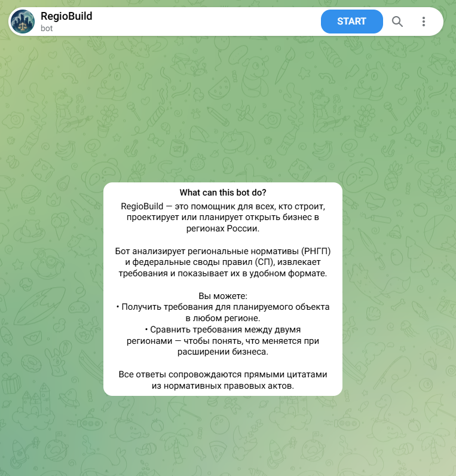
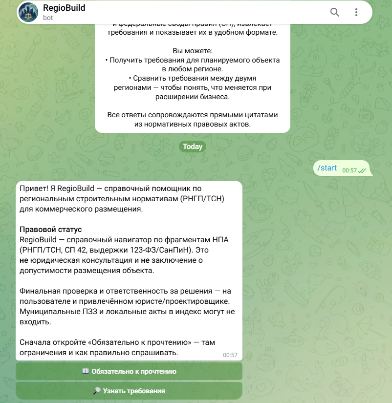
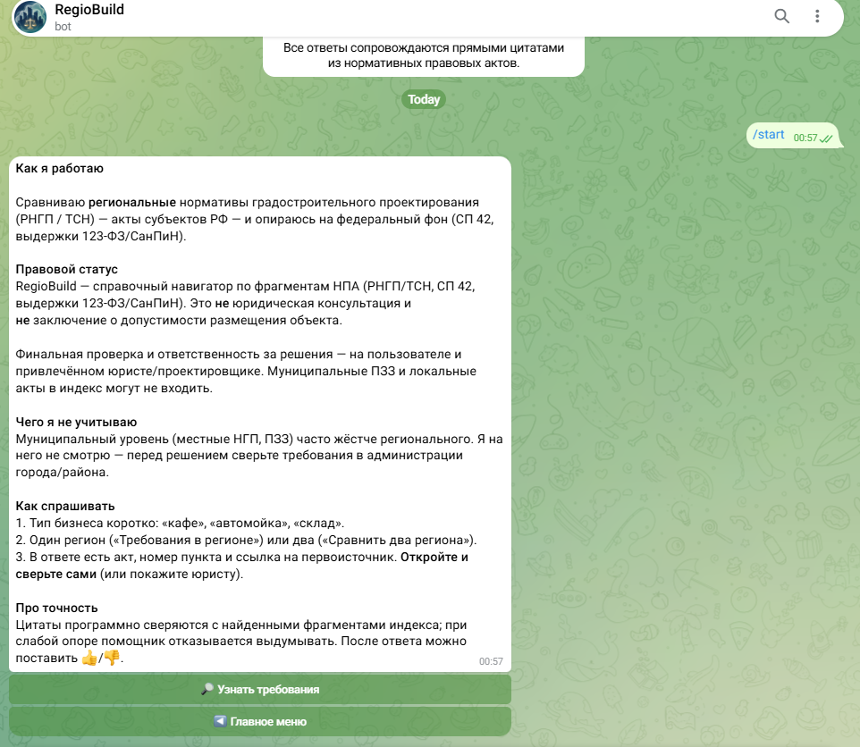
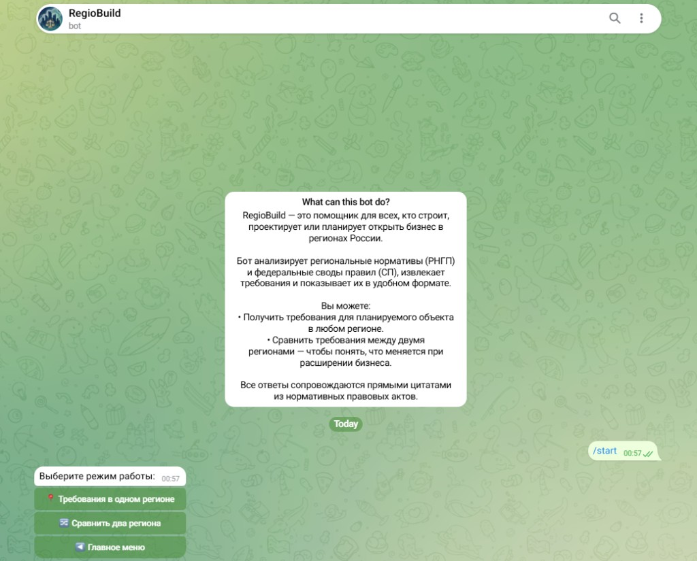
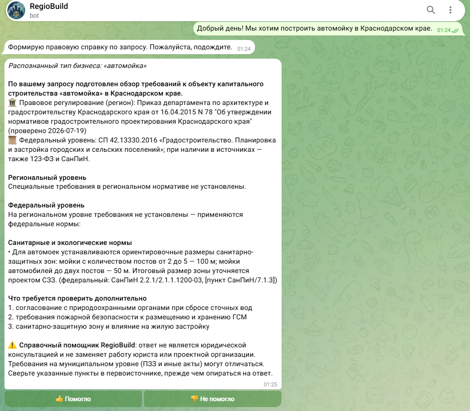
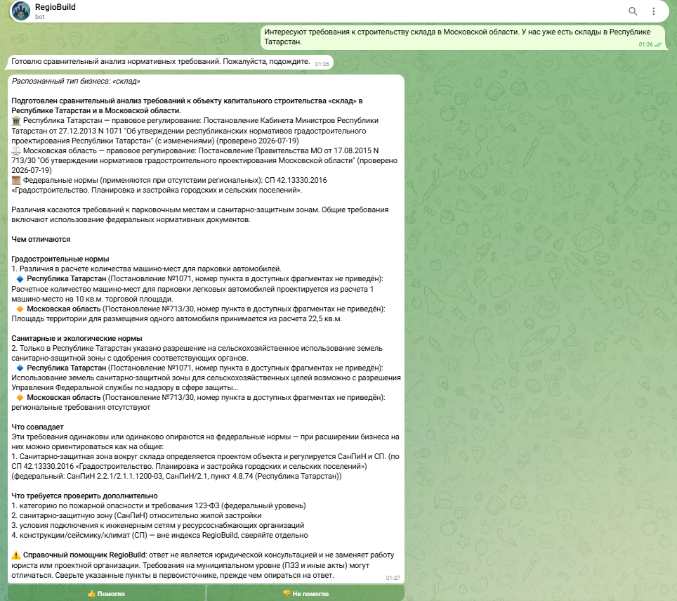

# RegioBuild

[Русская версия (основная)](README.md)

**A project for comparing regional construction planning standards (RNGP/TSN)
of constituent entities of the Russian Federation**, with a federal baseline
(SP 42.13330.2016 and curated excerpts from 123-FZ / SanPiN).

Telegram is a demonstration client. The core is a **RAG + LLM agent** with
mandatory grounding of material statements to a normative clause. The same API
can be deployed standalone and called from another application.

<p align="center">
  
</p>

---

## Status and context

To be clear: **the current build is not a finished commercial product.** There
is a working Telegram bot and API, programmatic citation checks against
retrieved fragments, and an index for five regions — but a durable service
still requires corpus expansion, municipal zoning (PZZ), better handling of
unusual phrasings, and ongoing data maintenance. Everything here was built
**alone**.

This is not “I spotted a market gap and left a startup half-done.” I hold a
bachelor’s and a master’s degree in law (Ural State Law University / УрГЮУ),
with subsequent legal practice and sales experience; fragmented regional
regulation is familiar from that background. After moving into ML I wanted to
test whether a retrieval pipeline with verifiable statute citations could be
assembled for this problem. The original goal was research and engineering,
not a product launch; serious follow-up work would need a team.

**On the git timeline.** For a long time the pipeline, vector index, and agent
were developed and tested **locally** (API, pytest, eval — no Telegram). I
registered the bot with BotFather only recently (creation date is visible
there), so the public git history mostly reflects deployment and the client
layer. This was not a three-day build: the core and NPA corpus came earlier,
without a remote repository and without a messenger client.

---

## The problem

Each Russian region has its own act on urban-planning design standards.
Regulatory density varies: one region may set hard parking rules for a car
wash; another is silent and leaves the federal framework. Lawyers and
designers know the cost — hours of manual comparison and a real risk of
missing a material siting condition.

RegioBuild is not a chat to “talk about construction.” It aims at a
**verifiable brief**: clause number and regulatory level (regional / federal).

### Subject-matter scope (wave 1)

Regions in the index: Moscow Oblast, Krasnodar Krai, Sverdlovsk Oblast,
Novosibirsk Oblast, Republic of Tatarstan. Federal layer: SP 42 and curated
123-FZ / SanPiN excerpts.

Object types: car wash, auto service, fuel station, warehouse, mall/store,
office, food service, hotel, medical center, production.

Not the full Ministry of Construction classifier and not every SP in Russia —
a deliberately narrow slice for typical commercial siting questions.

<p align="center">
  
  &nbsp;
  
</p>

**Legal status.** A reference navigator over NPA fragments; **not** legal
advice and **not** an opinion on whether a specific plot may host an object.
Municipal PZZ and other local acts may be absent from the index and must be
checked separately. Details: [`docs/LEGAL_DISCLAIMER.md`](docs/LEGAL_DISCLAIMER.md)
(Russian).

---

## Capabilities

1. **Requirements in one region** — overview by capital-construction object
   type, with regional and federal levels separated.
2. **Compare two regions** — differences and overlaps with clause citations.

Clause numbers from the model are checked against retrieved index fragments;
if there is no support, refusal is preferred over an invented norm.

<p align="center">
  
</p>

Example answers:

<p align="center">
  
</p>

<p align="center">
  
</p>

---

## Architecture and stack

| Layer | |
|-------|--|
| Language | Python 3.11 |
| Backend | FastAPI (`/info`, `/compare`, `/health`, `/metrics`) |
| Client | aiogram 3 |
| Orchestration | LangGraph |
| Retrieval | sentence-transformers (multilingual MiniLM), Chroma |
| Category classifier | scikit-learn (TF-IDF + LogisticRegression) |
| LLM | GigaChat in production; YandexGPT also in code |
| Data | SQLAlchemy + Alembic, disk LLM cache |
| Quality | pytest, Recall@k / MRR |
| Infra | Docker, GitHub Actions, Prometheus, Sentry |

One Docker image; role via `SERVICE_ROLE=api|bot`.

Pipeline sketch: [`docs/ARCHITECTURE.md`](docs/ARCHITECTURE.md) (Russian).

---

## Repository layout

```
RegioBuild/
  app/
    agent/         # LangGraph: normalize → retrieve → ground → format
    api/           # FastAPI
    bot/           # Telegram client
    classifier/
    core/          # regions, legal, business_type
    db/
    embeddings/
    eval/
    ingestion/     # parsing, curated
    llm/
    vectorstore/
  config/          # regions.yaml
  docs/
  migrations/
  scripts/
  tests/
  data/
    curated/       # in git
    chroma/        # vector index in git (image build without re-embed on a weak VPS)
    raw/ processed/  # local, not in git
  Dockerfile
```

---

## Engineering friction

- **NPA ingestion** — heterogeneous formats, table noise, false clause
  numbering, uneven corpus density across regions.
- **Retrieval and grounding** — user language ≠ statutory legalese; without
  usable-chunk filters and citation checks the model invents article numbers.
- **Ops on limited RAM** — embedder cold start, split api/bot roles. Pilot:
  Bothost + GigaChat. [`docs/BOTHOST_CHECKLIST.md`](docs/BOTHOST_CHECKLIST.md)
  (Russian).

---

## Local run

```bash
python -m venv venv
venv\Scripts\activate          # Linux/Mac: source venv/bin/activate
pip install -r requirements.txt
copy .env.example .env         # Linux/Mac: cp .env.example .env
```

Put LLM keys and the bot token in `.env`:

```bash
alembic upgrade head
python -m app.ingestion.pipeline        # rebuild corpus if needed
python -m app.embeddings.build_index
python -m app.classifier.train
python -m scripts.ingest_curated

uvicorn app.api.main:app --reload
python -m app.bot.main                  # second terminal
```

Or: `docker compose up --build`. Postgres: `docker-compose.postgres.yml`.

---

## Tests and quality

```bash
pytest
python -m app.eval.retrieval_eval
python -m app.eval.answer_eval
python -m scripts.audit_corpus
```

CI (GitHub Actions) runs a light suite without torch/chroma.
Post-deploy smoke: `scripts/smoke_wave1_prod.py`.

---

## Author

**Nikita Mokin**

Bachelor’s and master’s degrees in law (Ural State Law University / УрГЮУ).
Legal practice, then ML with a LegalTech focus.

[GitHub](https://github.com/NikitaMok) · [LinkedIn](https://ru.linkedin.com/in/mokinnikita)

---

## Rights

© Nikita Mokin. **All rights reserved.**

Copying the repository, reproducing substantial parts of the solution, and
using the code or product for commercial purposes **without the prior written
consent of the rights holder is prohibited**. Sources on GitHub are intended
for review and demonstration of competence, not as an open-source licence for
commercial exploitation.
