[Русская версия (основная)](README.md)

[](https://github.com/NikitaMok/RegioBuild/actions/workflows/ci.yml)
[](https://github.com/NikitaMok/RegioBuild/actions/workflows/deploy.yml)
[](https://www.python.org/downloads/)

Differences in regional urban-planning design standards across the Russian
Federation are hard to close by hand: each constituent entity of the Russian
Federation has its own act structure, density of regulation, and tables.
Federal norms set a baseline, but regional specifics often impose their own
requirements.

I know this problem space from a varied legal background. Even for an
experienced lawyer, comparing regional requirements between two constituent
entities of the Russian Federation for a single object type can take hours —
and that still does not guarantee complete accuracy, because a material clause
is easy to miss.

**RegioBuild** builds a structured list of requirements for a capital
construction object in a chosen constituent entity of the Russian Federation by
analysing RNGP/TSN and the applicable federal layer, and compares requirements
across two entities when needed.

Telegram ([https://t.me/regiobuild_bot](https://t.me/regiobuild_bot)) is only a
demonstration channel here. The product core is an HTTP API (`/info`,
`/compare`, `/api/v1/*`, `/health`, `/metrics`). External systems integrate
independently of the messenger.

---

## Terms of use

RegioBuild is a reference tool, not legal advice.  
The answers do not replace design documentation and/or a lawyer’s opinion, nor
an independent check that norms are current at the time of the request.  
Municipal land-use rules (PZZ) are not included in the index, so they must
still be verified separately.  
Details: [`docs/LEGAL_DISCLAIMER_EN.md`](docs/LEGAL_DISCLAIMER_EN.md).

---

## Welcome interface

<table width="100%">
  <tr>
    <td width="50%">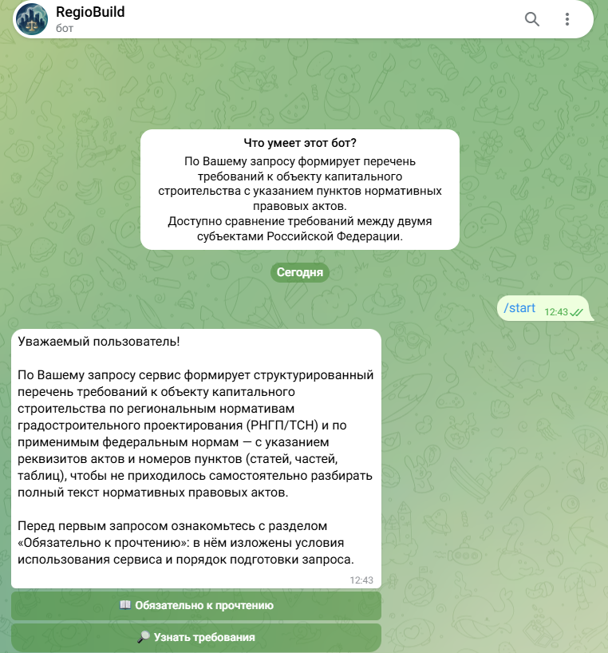</td>
    <td width="50%">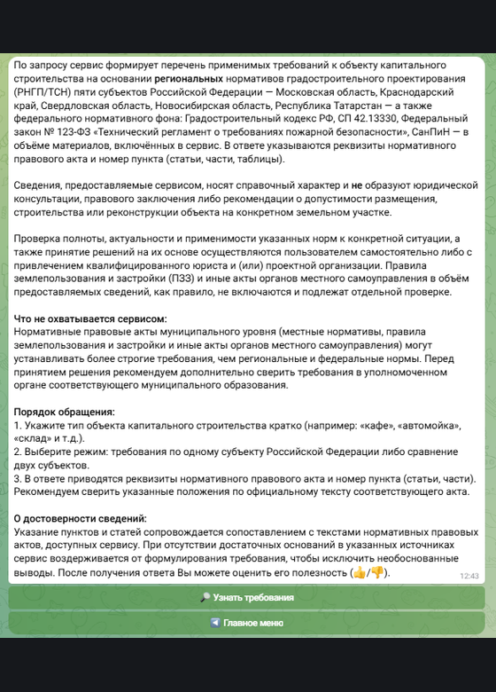</td>
  </tr>
</table>

---

## Query examples

### Query No. 1 — hotel comparison (Novosibirsk Oblast ↔ Moscow Oblast)

<table width="100%">
  <tr>
    <td width="33%">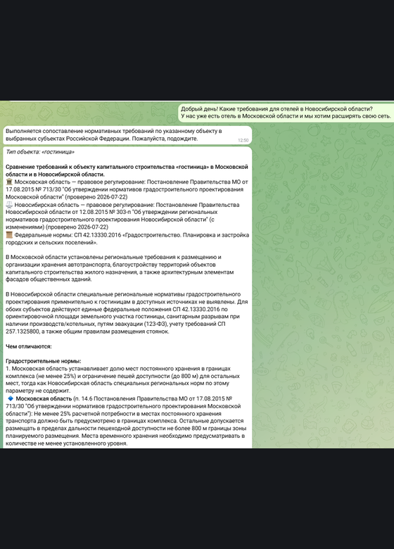</td>
    <td width="33%">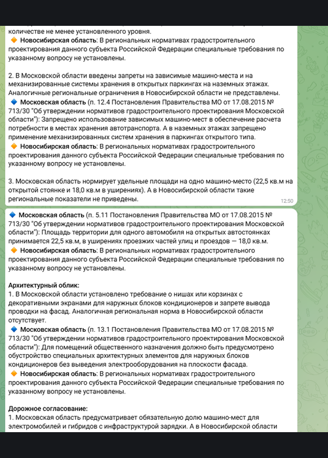</td>
    <td width="33%">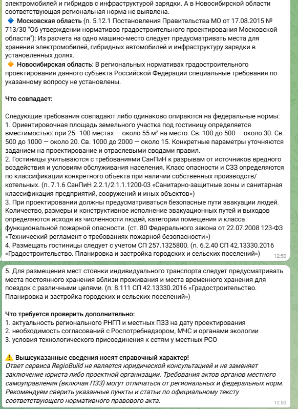</td>
  </tr>
</table>

### Query No. 2 — car wash (Sverdlovsk Oblast)

<table width="100%">
  <tr>
    <td width="50%">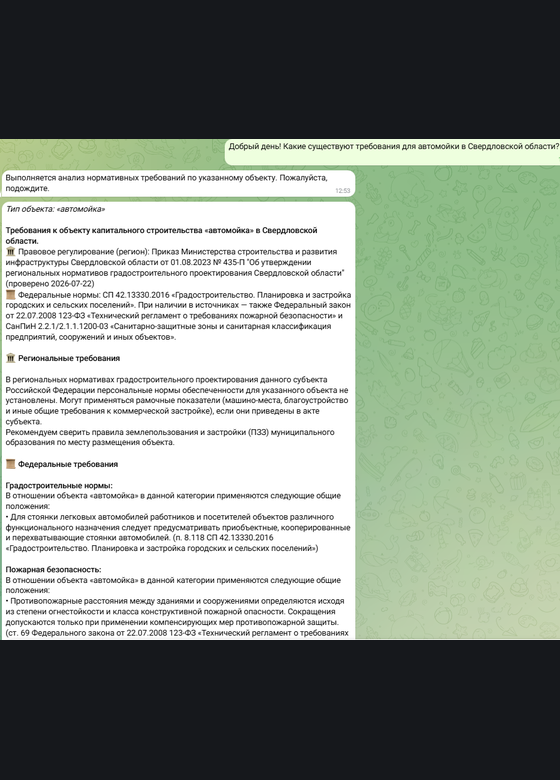</td>
    <td width="50%">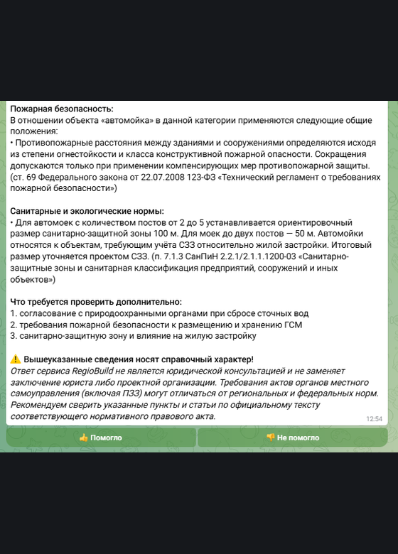</td>
  </tr>
</table>

---

## Feedback interface

<table width="100%">
  <tr>
    <td width="25%"></td>
    <td width="50%">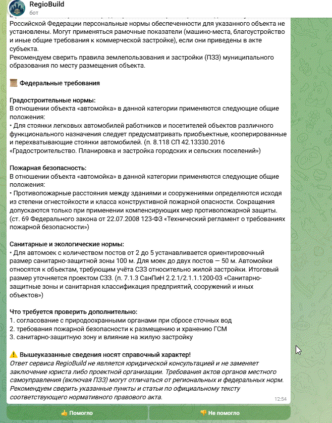</td>
    <td width="25%"></td>
  </tr>
</table>

---

## Operating modes

1. **Requirements overview for a chosen constituent entity of the Russian
   Federation** — regional and federal requirements for the object, with clause
   citations.
2. **Comparison of requirements between two constituent entities of the Russian
   Federation** — differences and overlaps in regional and federal requirements
   for the object, with clause citations.

---

## Regulatory corpus

| ISO 3166-2 | Entity |
|------------|--------|
| `RU-MOS` | Moscow Oblast |
| `RU-KDA` | Krasnodar Krai |
| `RU-SVE` | Sverdlovsk Oblast |
| `RU-NVS` | Novosibirsk Oblast |
| `RU-TA` | Republic of Tatarstan |
| `RU-FED` | Federal layer: Urban Planning Code, SP 42, 123-FZ, SanPiN |

The index is limited to this corpus. Local zoning (PZZ) / municipal level are
out of scope. Adding a region is a config-and-data procedure:
[`docs/ADDING_REGION_EN.md`](docs/ADDING_REGION_EN.md).

---

## Solution architecture

In short:

1. **Ingestion** — PDF/HTML/DOCX → hierarchical parse → chunks in Qdrant.
2. **Retrieval** — object-type normalization, multi-query, hybrid dense + BM25,
   ranking that prefers reliable sections and curated anchors.
3. **Grounding** — a model-proposed clause enters the answer only if it matches
   retrieved fragments; weak support yields an explicit refusal.
4. **Agent** — LangGraph: normalize → understand → retrieve → classify →
   rerank → LLM → format/guardrail.
5. **LLM** — GigaChat Ultra (`GigaChat-3-Ultra`), `temperature=0.0`.

Details: [`docs/ARCHITECTURE_EN.md`](docs/ARCHITECTURE_EN.md).

Retrieval evaluation (clause-anchor hit rate, not legal correctness):

| Set | Hit rate |
|-----|----------|
| `data/eval/golden.jsonl` | 100/100 |
| `data/eval/blind_paraphrase.jsonl` | 60/60 |

---

## Application programming interface (API)

The commercial surface is `/api/v1` with `X-API-Key` authentication and
machine-readable citations (document, clause, level, verification date).
Interactive spec: `GET /docs`.

```bash
python -m scripts.manage_api_keys create --name "Client LLC" --daily-limit 200

curl -X POST https://<host>/api/v1/info \
  -H "Content-Type: application/json" \
  -H "X-API-Key: rgb_…" \
  -d '{"region": "RU-KDA", "object_type": "автомойка"}'
```

Client example: [`examples/api_client.py`](examples/api_client.py).

---

## Production environment and monitoring

Production runs on an Aeza VPS (Moscow): nginx, API, Telegram bot, Prometheus,
Grafana Cloud (remote_write), Alertmanager, weekly backups. Deploy path:
GitHub Actions → SSH → `scripts/deploy_remote.sh` + `scripts/verify_deploy.sh`
(`verify OK`).

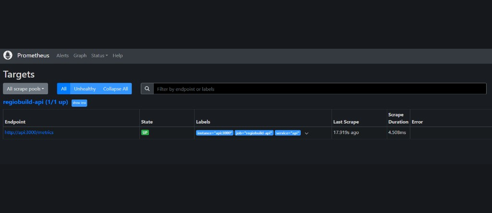

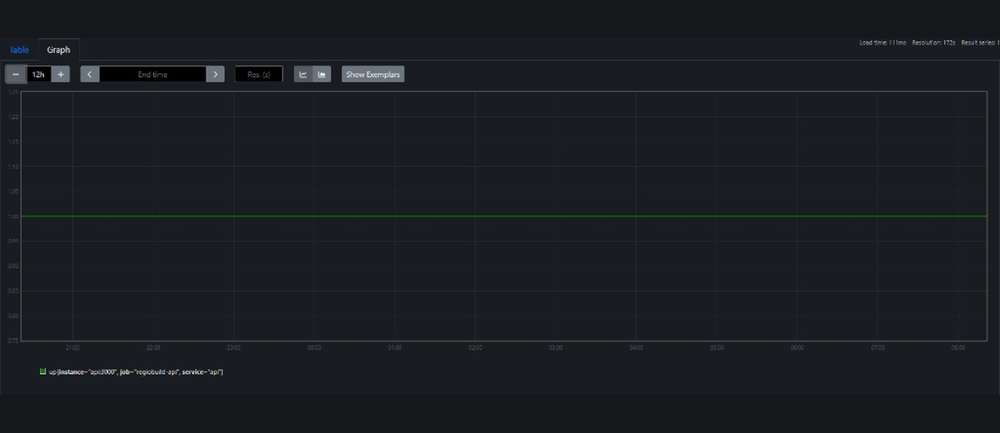

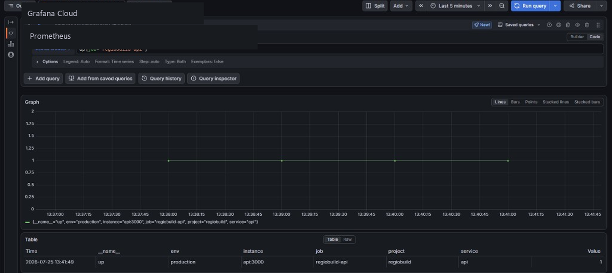

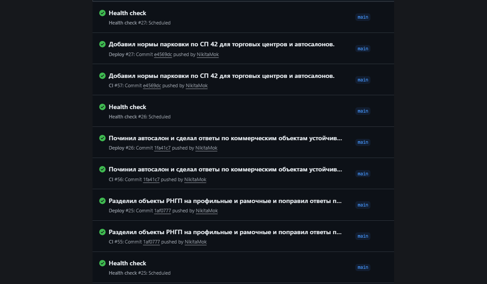

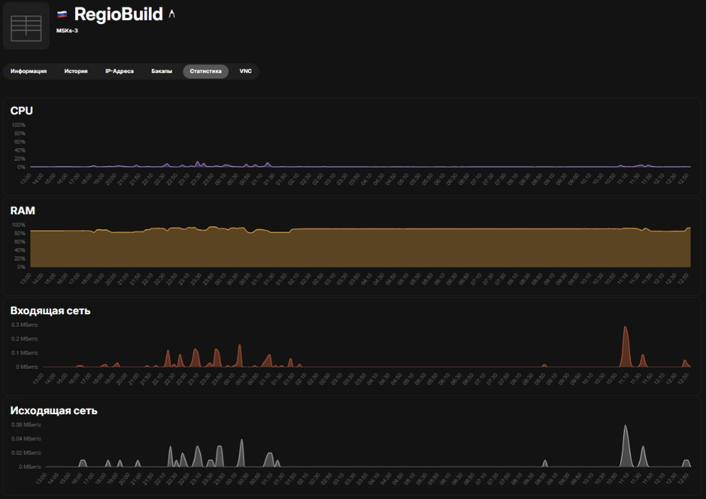

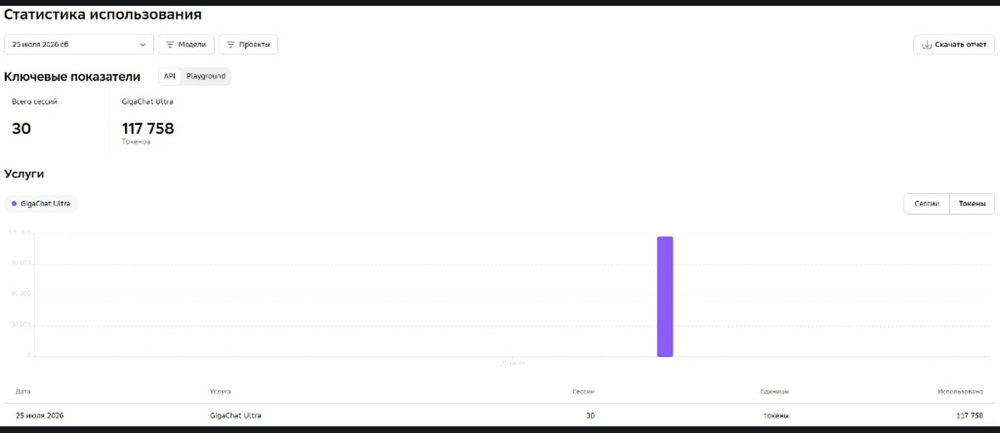

---

## Technology stack

| Layer | Components |
|-------|------------|
| Language | Python 3.11 |
| Backend | FastAPI |
| Client | aiogram 3 |
| Orchestration | LangGraph |
| Embeddings | fastembed (ONNX) |
| Vector DB | Qdrant Cloud |
| Classification | scikit-learn (TF-IDF + LogisticRegression) |
| LLM | GigaChat Ultra |
| Data | SQLAlchemy, Alembic |
| Observability | Prometheus, Grafana Cloud, Sentry |
| Infrastructure | Docker, GitHub Actions, Aeza VPS |

---

## Local setup and development

```
RegioBuild/
  app/           # agent, api, bot, ingestion, vectorstore, llm
  config/        # regions.yaml, documents.yaml, object_categories.yaml
  docs/
  migrations/
  scripts/
  tests/
  data/          # curated; raw/processed/structured — local
```

```bash
python -m venv venv
venv\Scripts\activate          # Linux/Mac: source venv/bin/activate
pip install -r requirements.txt
copy .env.example .env         # Linux/Mac: cp .env.example .env
```

Configure GigaChat in `.env`, and optionally the bot token and Qdrant settings.

```bash
alembic upgrade head
python -m scripts.parse_pdf_docs   # if data/raw/docs is present
python -m scripts.index_qdrant

uvicorn app.api.main:app --reload
python -m app.bot.main
```

Production: `docker compose -f docker-compose.prod.yml --env-file .env up -d --build`.

```bash
pytest
python -m scripts.eval_golden
```

---

© Nikita Mokin / Никита Мокин  
[GitHub](https://github.com/NikitaMok) ·
[LinkedIn](https://ru.linkedin.com/in/mokinnikita)

All rights reserved.  
Copying the repository, reproducing material parts of the solution, and
commercial use of the code or product without prior written consent of the
rights holder are prohibited.  
Publication on GitHub is for demonstration of competence and does not grant a
licence for commercial exploitation.
