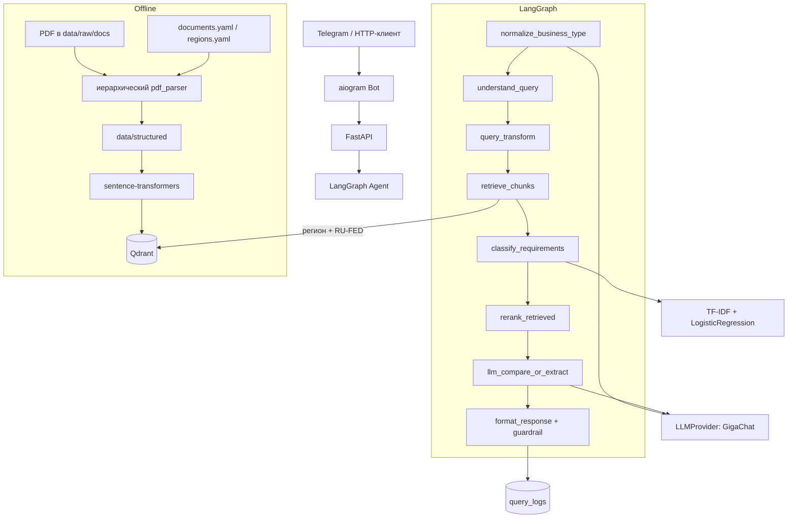

# Архитектура RegioBuild

Как устроен пайплайн от НПА до ответа. Продуктовое описание —
[`README.md`](../README.md).

## Схема

## Решения

- **Retrieval и generation разделены.** Метрики поиска (Recall@k, MRR) и
  читаемость ответа смотрим отдельно — иначе непонятно, чинить индекс или промпт.
- **`LLMProvider`.** Один интерфейс; в проде GigaChat. YandexGPT в коде есть,
  failover по умолчанию выключен.
- **Нормализация типа объекта до retrieval.** Длинные фразы и падежи плохо
  матчятся с канцеляритом НПА: сначала whitelist/корни, модель — если не вышло.
- **Гибридный retrieval.** Dense (Qdrant) + лёгкий BM25 по кандидатам; при
  `VECTOR_BACKEND=chroma` — тот же контракт на legacy-индексе.
- **Embeddings.** На Bothost/demo — `fastembed` (ONNX, без PyTorch в RAM).
  Enterprise может использовать `sentence_transformers` (в т.ч. e5-large) через
  `EMBEDDING_BACKEND` и `requirements-enterprise-embeddings.txt`. Индекс и
  runtime должны совпадать по backend.
- **Федеральный фон.** `RU-FED` не выбирается как «регион» в UI. Региональный
  акт в приоритете; федеральные фрагменты идут с явной пометкой уровня.
- **Grounding и guardrail.** Пункты из JSON модели сверяются с
  `section_number` чанков; лишние цифры в ответе могут заблокировать выдачу.
  Нет опоры в корпусе — честный отказ, без нормы «от себя».
- **API отдельно от бота.** Telegram ходит на `/info` и `/compare`; есть также
  `/api/v1/info` и `/api/v1/compare` для внешнего контура.

## Роли в runtime

Один образ, `SERVICE_ROLE`:

| Роль | Процесс |
|------|---------|
| `api` | FastAPI, warmup embeddings, `/metrics` |
| `bot` | aiogram long polling → HTTP к API |

Локально удобен `docker compose`. На хостинге — два инстанса одного Dockerfile.

`WARMUP_ON_START=delayed` предпочтительнее `immediate` на машинах с ~2 GB RAM.

## Данные

| Слой | Назначение |
|------|------------|
| `data/raw/docs` | исходные PDF (не в git) |
| `data/structured` | clauses/chunks после `parse_pdf_docs` |
| `config/documents.yaml` | манифест ingest (federal/regional; municipal выключен) |
| `config/regions.yaml` | ISO-коды, алиасы, реквизиты актов |
| Qdrant Cloud / локальный | коллекция `regiobuild_normative` |
| `data/chroma` | legacy-индекс (опционально) |
| `data/curated` | точечные выдержки (123-ФЗ, СанПиН и др.) |
| SQL | документы, чанки, `query_logs` |

## Observability

- Prometheus: `GET /metrics` (в т.ч. `regiobuild_guardrail_blocks_total`)
- Sentry по `SENTRY_DSN`
- LLM cache: memory + disk
- Дневной лимит запросов на `telegram_user_id`

Подключение Grafana Cloud: [`GRAFANA.md`](GRAFANA.md) — нужны scrape или
remote write; одних переменных в env недостаточно.
