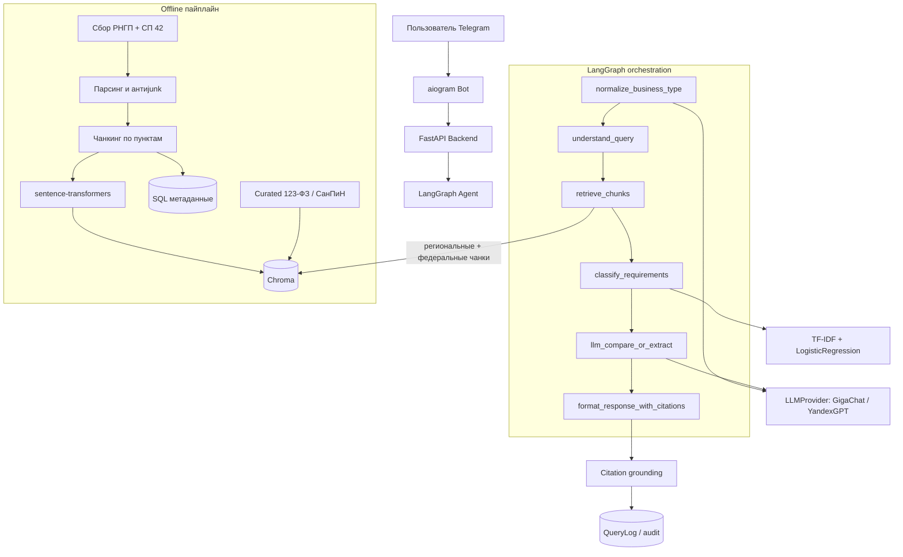

# Архитектура RegioBuild

Техническое устройство пайплайна: от НПА до ответа пользователю. Продуктовое
описание — в корневом [`README.md`](../README.md).

## Общая схема

## Почему так

- **Retrieval и generation разведены.** Recall@k / MRR и «юридическую читаемость»
  ответа меряем отдельно — иначе непонятно, где чинить: индекс или промпт.
- **`LLMProvider`.** Общий интерфейс под GigaChat и YandexGPT: вендора меняем
  без переписывания графа. В проде по умолчанию GigaChat; failover на Yandex
  не включаем без явной необходимости.
- **`normalize_business_type` до retrieval.** Длинные фразы («требования к
  строительству автомойки…») и падежи плохо матчятся с канцеляритом НПА.
  Сначала извлекаем тип объекта (корни/whitelist), LLM — только если не вышло.
- **Федеральный фон.** СП 42.13330.2016 (и curated-выдержки 123-ФЗ / СанПиН)
  не выбираются как «регион». Приоритет у регионального акта; федеральный
  подмешивается с явной пометкой уровня.
- **Citation grounding.** Пункты из ответа LLM сверяются с retrieved-чанками;
  выдуманные номера отбрасываются. При пустом usable retrieval — честный отказ,
  без галлюцинаций «от себя».
- **API отдельно от бота.** Telegram — один из клиентов. Тот же FastAPI можно
  повесить на веб, B2B-кабинет или чужой продукт.

## Runtime-роли

Один Docker-образ, роль через `SERVICE_ROLE`:

| Роль | Процесс |
|------|---------|
| `api` | FastAPI (`/info`, `/compare`, `/health`, `/metrics`), warmup embeddings |
| `bot` | aiogram long polling → HTTP к API |

Локально удобнее `docker-compose` (два сервиса). На хостинге без compose —
два инстанса одного `Dockerfile`.

## Данные

| Слой | Назначение |
|------|------------|
| `data/raw` | исходники НПА (не в git) |
| `data/processed` | чанки после парсинга (не в git) |
| `data/chroma` | векторный индекс (в git — для сборки образа без переиндекса на слабой VPS) |
| `data/curated` | точечные выдержки (123-ФЗ, СанПиН, региональные якоря) |
| SQL (SQLite/Postgres) | документы, чанки, `query_logs` (audit: секции, latency, feedback) |

## Observability

- Prometheus: `GET /metrics`
- Sentry: по `SENTRY_DSN`
- LLM cache: memory + disk (экономия токенов на повторах)
- Rate limit: дневной лимит на `telegram_user_id`
