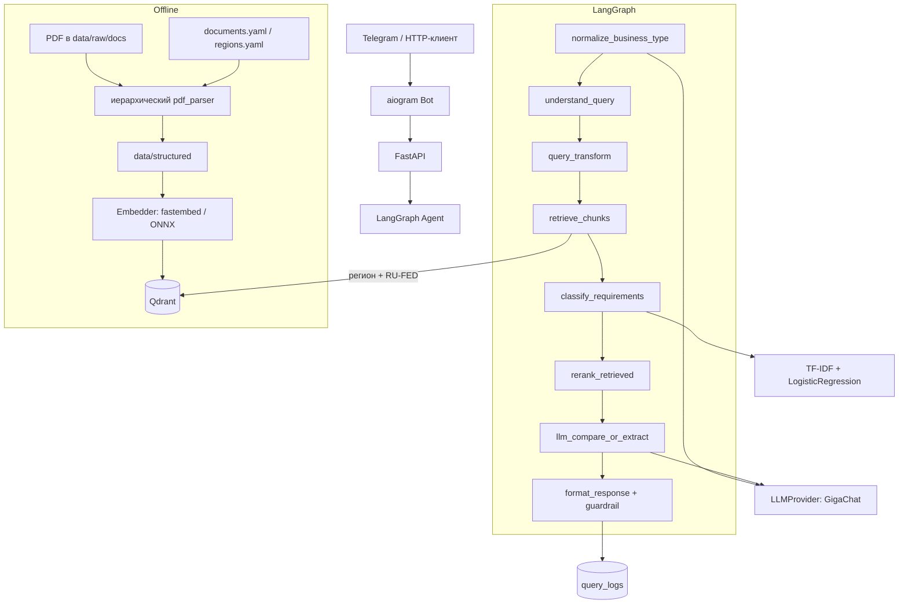

# Архитектура RegioBuild

[English version](ARCHITECTURE_EN.md)

Пайплайн от нормативного акта до ответа. Продуктовое описание —
[`README.md`](../README.md).

## Схема

```mermaid
flowchart TD
    User[Telegram / HTTP-клиент] --> Bot[aiogram Bot]
    Bot --> API[FastAPI]
    API --> Agent[LangGraph Agent]

    subgraph AgentFlow [LangGraph]
        N0[normalize_business_type] --> N1[understand_query]
        N1 --> N2[query_transform]
        N2 --> N3[retrieve_chunks]
        N3 --> N4[classify_requirements]
        N4 --> N5[rerank_retrieved]
        N5 --> N6[llm_compare_or_extract]
        N6 --> N7[format_response + guardrail]
    end

    N0 --> LLM["LLMProvider: GigaChat"]
    N3 -- "регион + RU-FED" --> VectorDB[(Qdrant)]
    N4 --> Classifier["TF-IDF + LogisticRegression"]
    N6 --> LLM
    N7 --> QueryLog[(query_logs)]

    subgraph Ingestion [Offline]
        PDF[PDF в data/raw/docs] --> Parse[иерархический pdf_parser]
        Parse --> Structured[data/structured]
        Structured --> Embed["Embedder: fastembed / ONNX"]
        Embed --> VectorDB
        Manifest[documents.yaml / regions.yaml] --> Parse
    end
```

Узлы графа совпадают с `app/agent/graph.py`: normalize → understand →
query_transform → retrieve → classify → rerank → LLM → format/guardrail.

## Решения

- **Retrieval и generation разделены.** Метрики поиска (Recall@k, MRR) и
  читаемость ответа смотрим отдельно — иначе непонятно, чинить индекс или промпт.
- **`LLMProvider`.** Один интерфейс; в проде GigaChat Ultra (`GigaChat-3-Ultra`,
  `api.giga.chat`), `temperature=0.0`. YandexGPT в коде есть, failover по
  умолчанию выключен.
- **Нормализация типа объекта до retrieval.** Длинные фразы и падежи плохо
  матчятся с канцеляритом НПА: сначала whitelist/корни, модель — если не вышло.
- **Тиры объектов.** `group1` — профильные объекты РНГП (персональные нормы
  обеспеченности); `group2` — рамочная коммерция (парковка, отступы, озеленение
  + федеральный слой только из retrieved-чанков). См.
  `config/object_categories.yaml`.
- **Гибридный retrieval.** Dense (Qdrant) + лёгкий BM25 по кандидатам.
- **Embeddings.** В проде — `fastembed` (ONNX). Индекс и runtime должны
  совпадать по backend.
- **Федеральный фон.** `RU-FED` не выбирается как «регион» в UI. Региональный
  акт в приоритете; федеральные требования — отдельным блоком.
- **Скоуп корпуса.** Муниципальные ПЗЗ и местные НГП вне индекса; при ответе
  пользователю указывается необходимость отдельной проверки.
- **Grounding и guardrail.** Пункты из JSON модели сверяются с
  `section_number` чанков. Нет опоры в корпусе — честный отказ.
- **Формат ответа.** Нумерация различий с 1 в каждой категории; знак номера
  НПА — «№»; точки с запятой в пользовательском тексте убираются при
  полировке; блок доп. проверок — один раз на ответ.
- **API отдельно от бота.** Telegram ходит на `/info` и `/compare`; есть
  `/api/v1/info` и `/api/v1/compare` для внешнего контура.

## Роли в runtime

Один образ, `SERVICE_ROLE`:

| Роль | Процесс |
|------|---------|
| `api` | FastAPI, warmup embeddings, `/metrics` |
| `bot` | aiogram long polling → HTTP к API |

Прод — VPS Aeza (nginx, API, bot, Prometheus → Grafana Cloud remote_write,
Alertmanager). Compose: `docker-compose.prod.yml`.

## Данные

| Путь | Назначение |
|------|------------|
| `data/raw/docs` | исходные PDF (не в git) |
| `data/structured` | clauses/chunks после `parse_pdf_docs` |
| `config/documents.yaml` | манифест ingest |
| `config/regions.yaml` | ISO-коды, алиасы, реквизиты актов |
| Qdrant Cloud | коллекция `regiobuild_normative` |
| `data/curated` | точечные выдержки (123-ФЗ, СанПиН, СП 42 и др.) |
| SQL | документы, чанки, `query_logs` |

Продуктовый скоуп: **5 субъектов + федеральный слой**. Архитектура допускает
расширение без ломки контрактов (см. [`ADDING_REGION.md`](ADDING_REGION.md)).

## Observability

- Prometheus: `GET /metrics` (в т.ч. `regiobuild_guardrail_blocks_total`)
- Grafana Cloud: `remote_write` из Prometheus (учётные данные — только в `.env`)
- Sentry по `SENTRY_DSN`
- LLM cache: memory + disk
- Дневной лимит запросов на `telegram_user_id`
