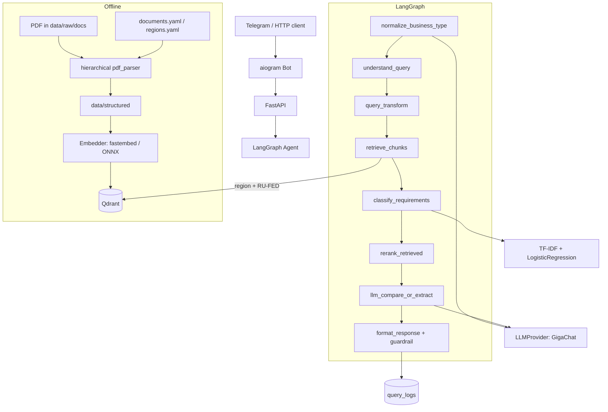

# RegioBuild architecture

[Русская версия](ARCHITECTURE.md)

Pipeline from a normative act to an answer. Product overview:
[`README_EN.md`](../README_EN.md).

## Diagram

Graph nodes match `app/agent/graph.py`: normalize → understand →
query_transform → retrieve → classify → rerank → LLM → format/guardrail.

## Design choices

- **Retrieval and generation are separated.** Search metrics (Recall@k, MRR) and
  answer readability are evaluated independently — otherwise it is unclear
  whether to fix the index or the prompt.
- **`LLMProvider`.** One interface; production uses GigaChat Ultra
  (`GigaChat-3-Ultra`, `api.giga.chat`) with `temperature=0.0`. YandexGPT exists
  in code; failover is off by default.
- **Object-type normalization before retrieval.** Long phrases and case forms
  match poorly against statutory language: whitelist/roots first, then the model
  if needed.
- **Object tiers.** `group1` — specialised RNGP objects (personal provision
  norms); `group2` — framework commercial objects (parking, setbacks,
  landscaping + federal layer only from retrieved chunks). See
  `config/object_categories.yaml`.
- **Hybrid retrieval.** Dense (Qdrant) + light BM25 over candidates.
- **Embeddings.** Production uses `fastembed` (ONNX). Index and runtime backends
  must match.
- **Federal layer.** `RU-FED` is not selectable as a “region” in the UI. The
  regional act has priority; federal requirements appear as a separate block.
- **Corpus scope.** Municipal PZZ and local NGP are outside the index; answers
  tell the user to verify them separately.
- **Grounding and guardrail.** Model JSON clauses are checked against chunk
  `section_number` values. Without corpus support — an explicit refusal.
- **Answer format.** Difference numbering restarts at 1 per category; act numbers
  use «№»; semicolons in user-facing text are removed during polish; the
  additional-checks block appears once per answer.
- **API separate from the bot.** Telegram calls `/info` and `/compare`;
  `/api/v1/info` and `/api/v1/compare` serve the external surface.

## Runtime roles

One image, `SERVICE_ROLE`:

| Role | Process |
|------|---------|
| `api` | FastAPI, embedding warmup, `/metrics` |
| `bot` | aiogram long polling → HTTP to API |

Production — Aeza VPS (nginx, API, bot, Prometheus → Grafana Cloud remote_write,
Alertmanager). Compose: `docker-compose.prod.yml`.

## Data

| Path | Purpose |
|------|---------|
| `data/raw/docs` | source PDFs (not in git) |
| `data/structured` | clauses/chunks after `parse_pdf_docs` |
| `config/documents.yaml` | ingest manifest |
| `config/regions.yaml` | ISO codes, aliases, act metadata |
| Qdrant Cloud | collection `regiobuild_normative` |
| `data/curated` | curated excerpts (123-FZ, SanPiN, SP 42, etc.) |
| SQL | documents, chunks, `query_logs` |

Product scope: **5 regions + federal layer**. The architecture allows expansion
without breaking contracts (see [`ADDING_REGION_EN.md`](ADDING_REGION_EN.md)).

## Observability

- Prometheus: `GET /metrics` (incl. `regiobuild_guardrail_blocks_total`)
- Grafana Cloud: Prometheus `remote_write` (credentials only in `.env`)
- Sentry via `SENTRY_DSN`
- LLM cache: memory + disk
- Daily query limit per `telegram_user_id`
